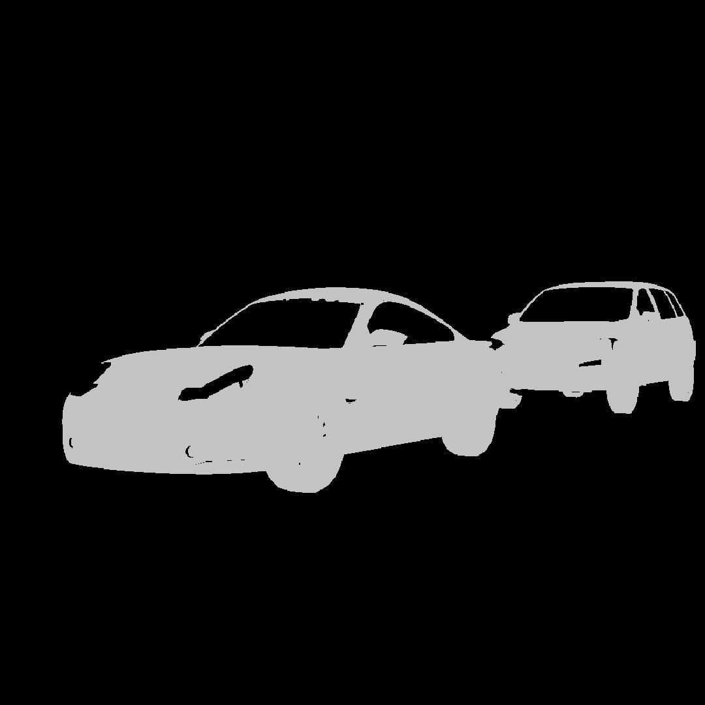

# DeeplabV3+ model demo

DeeplavV3 image segmentation with **UE5 generated dataset** and **Tensorflow.js**

## UE5 Generated Dataset

https://www.unrealengine.com/marketplace/en-US/product/city-sample

I use UE5 tech demo "city sample" asset for generate train, validation dataset
and this repo also contains dataset at `model/unreal-car-dataset`

image|mask
---|---
|

The data set looks like this. In fact, since the class value of the mask has a gray scale of 1, the actual data cannot be distinguished by the eye unless the gamma is raised.

## Tensorflow.js with react

Provides a web app using tensorflow js.

Learned models are already included and can be used as soon as you run them.

###  [build](https://noname0310.github.io/DeepLabV3Plus/build/index.html)

## File Structure

**model: contains model train, model save, model convert, train/validation dataset**

- model/train_model.py - train model and generate h5
- model/use_model.py - test model with validation data
- model/tfjs_modelgen.py - convert model compatible to tensorflow.js

**webapp: react web app that load the model using tenserflow.js** 

- webapp/public/tfjs-model - converted model for tenserflow.js
